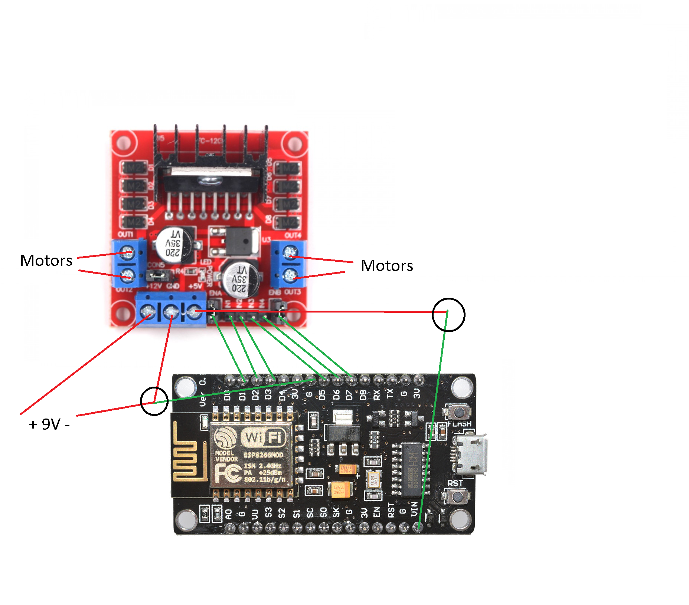

# ESP8266_RC_car

## Hardware:
* ESP8266 NodeMCU
* L298n Motor Driver
* Jumper Wires F-to-F (x8)
* motors (with gearboxes)
* wire
* 9V battery clip
* 9V battery
* Micro USB cable

# Assembly instructions:
1. Remove the jumpers on ENA and ENB on the L298n motor controller
1. Connect up components as shown in the diagram below (red wires: jumper wires, black wires: misc, circles: soldering required)

1. Download and install the Arduino IDE: https://www.arduino.cc/en/Main/Software
1. Open Arduino IDE and go to **File > Preferrences** and copy and paste: https://arduino.esp8266.com/stable/package_esp8266com_index.json into the _Additional Board Manager URLs_
1. Go to **Tools > Board > Board Manager**
1. Search for and Install _esp8266_ (IMPORTANT: INSTALL VERSION 2.7.4)
1. Download the lastest build file
1. Open src.ino in the Arduino IDE
1. Go to **Tools > Board > ESP8266 Boards > NodeMCU 1.0**
1. Connect _esp8266_ to computer using Micro USB cable
1. Go to **Tools > Port** and select the port the _ESP8266_ is connected to. 
1. Upload the code (may take few minutes)
1. Connect to the WiFi
1. Go to the web portal

## Notes
* default wifi
  * SSID: RC Car
  * Password: 12345678
* default portal: 192.168.1.1 (type this into your browser)

# Aditional Settings
For slightly better performance try:
* setting the CPU Frequency to 160 MHz
* setting the IwIP variant: v2 Higher Bandwidth
